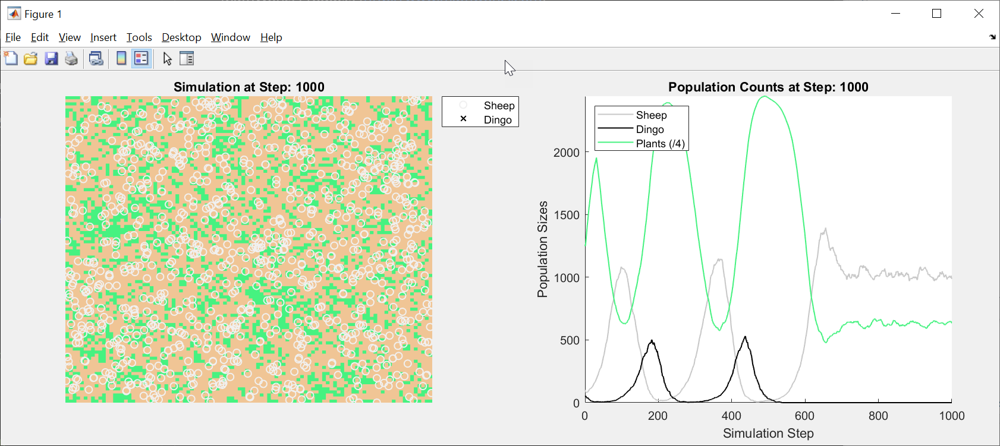

# Dynamic Population Models with MATLAB Object Oriented Code
This code is what was presented for the Australian AgTech Webinar on 16th March 2021.  It showcases how to stack together objects to create a world in which plants grow, herbivores eat and are eaten by carnivores.  The key is that this object approach and the world framework is flexible and extensible.  For example, the system can be adapted to model fishing fleets and fish populations, or harvest strategies for logging operations.

## Setup 
To Run:
1. Open the MATLAB® Project prj file
2. grassLivesForever.m: for a simple development version where the grass lives forever
3. grassDies.m: for the final version where the grass is consumed and takes time to regrow

### MathWorks Products (https://www.mathworks.com)

This demonstration was developed in R2021a but should be quite backward compatible.  The following are recommended products as simulations such as this are often placed into a much larger Monte Carlo framework.
- [Statistics and Machine Learning Toolbox®](https://www.mathworks.com/products/statistics.html)
- [Parallel Computing Toolbox®](https://www.mathworks.com/products/parallel-computing.html)
- [MATLAB Parallel Server®](https://www.mathworks.com/products/matlab-parallel-server.html)

## License
The license for this population modelling code is available in the [LICENSE.TXT](license.txt) file in this repository.

## Community Support
[MATLAB Central](https://www.mathworks.com/matlabcentral)

Copyright &copy; 2021 - 2023 The MathWorks, Inc.
